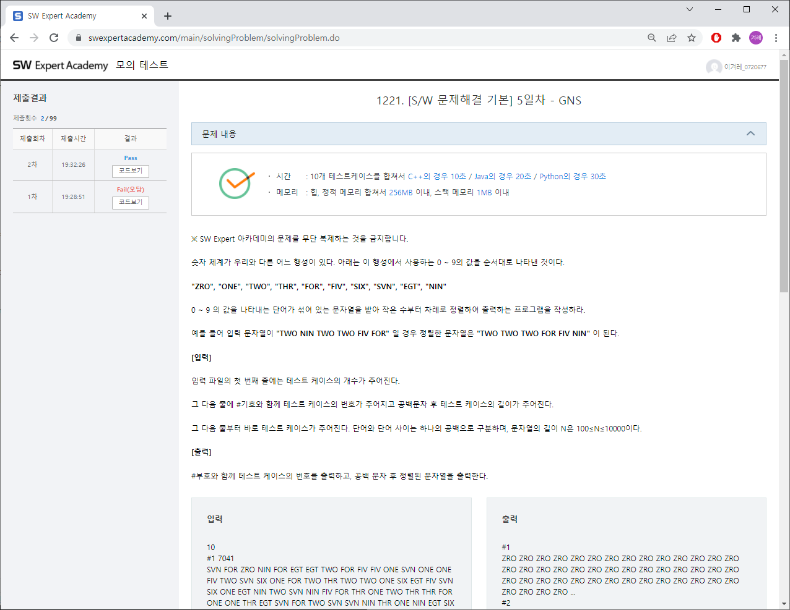

```python
import sys

sys.stdin = open('input.txt', encoding='utf-8')

# testcase 수
T = int(input())

for t in range(T):
    # 순번, 숫자 개수
    N, len_word = map(str, input().split())

    # 숫자 개수를 int 로 전환
    M = int(len_word)

    # 문자열 list 로 입력 받음
    Alien_number = list(input().split())

    # 번역용 list
    Trans = ['ZRO', 'ONE', 'TWO', 'THR', 'FOR', 'FIV', 'SIX', 'SVN', 'EGT', 'NIN']

    # 번역
    for i in range(M):
        for j in range(len(Trans)):
            if Alien_number[i] == Trans[j]:
                Alien_number[i] = j
                # 더 진행할 필요 없으니 break
                break

    # 선택 정렬
    for i in range(M-1, 0, -1):
        for j in range(i):
            if Alien_number[j] > Alien_number[j+1]:
                Alien_number[j], Alien_number[j+1] = Alien_number[j+1], Alien_number[j]

    # 재번역
    for i in range(M):
        for j in range(len(Trans)):
            if Alien_number[i] == j:
                Alien_number[i] = Trans[j]
                # 더 진행할 필요 없으니 break
                break

    # 형식에 맞춰 출력
    print(N)
    for i in range(M):
        print(Alien_number[i], end=' ')

```

> 1221 GNS




> 출력형식 문제로 1번 Fail
